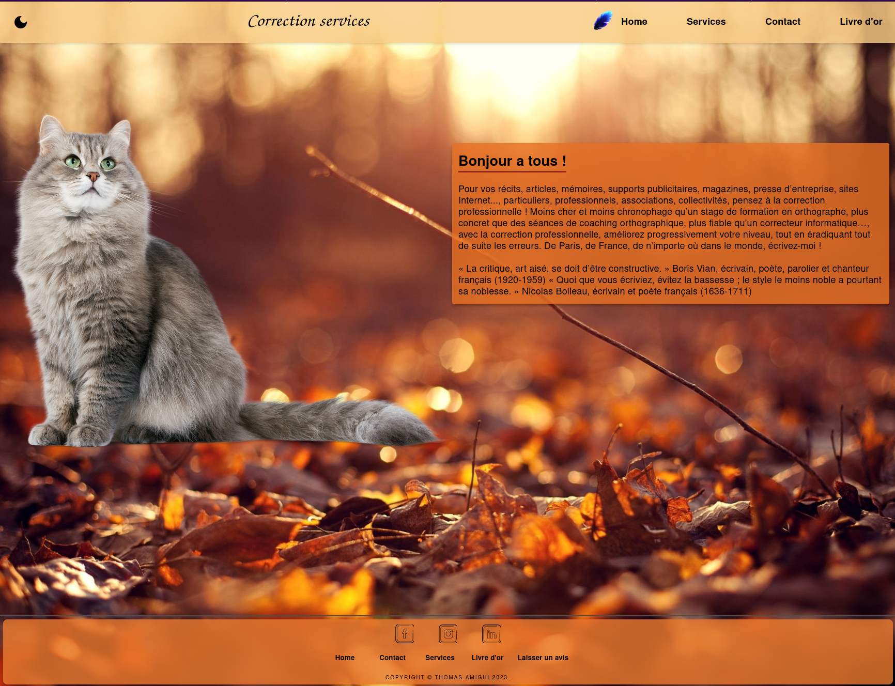
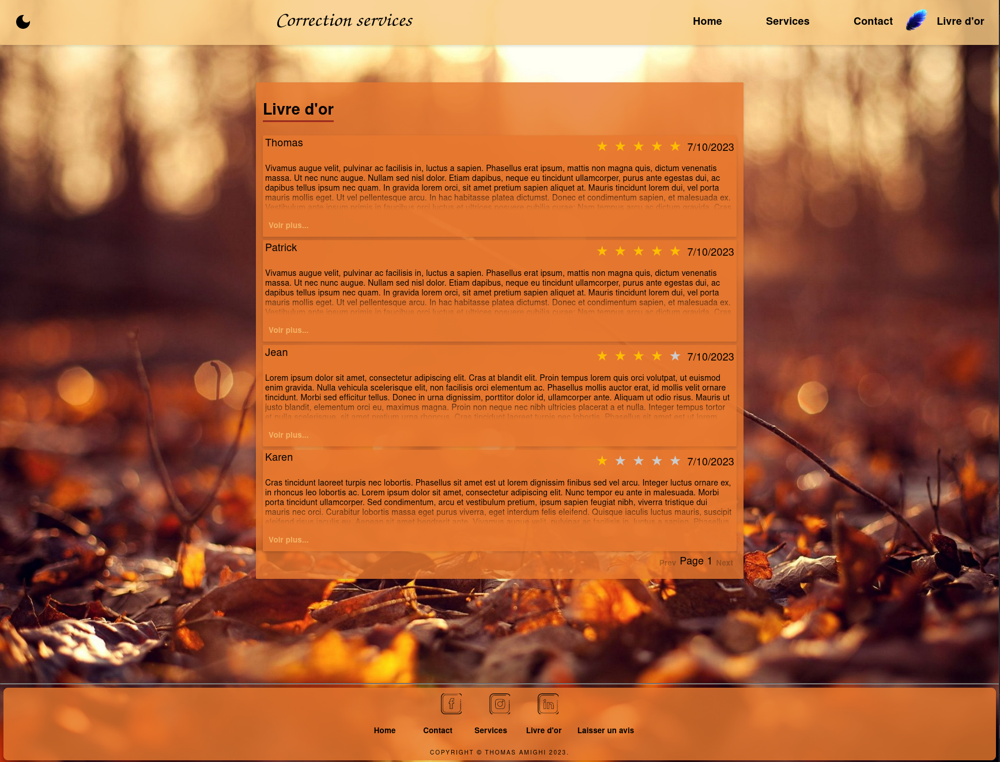
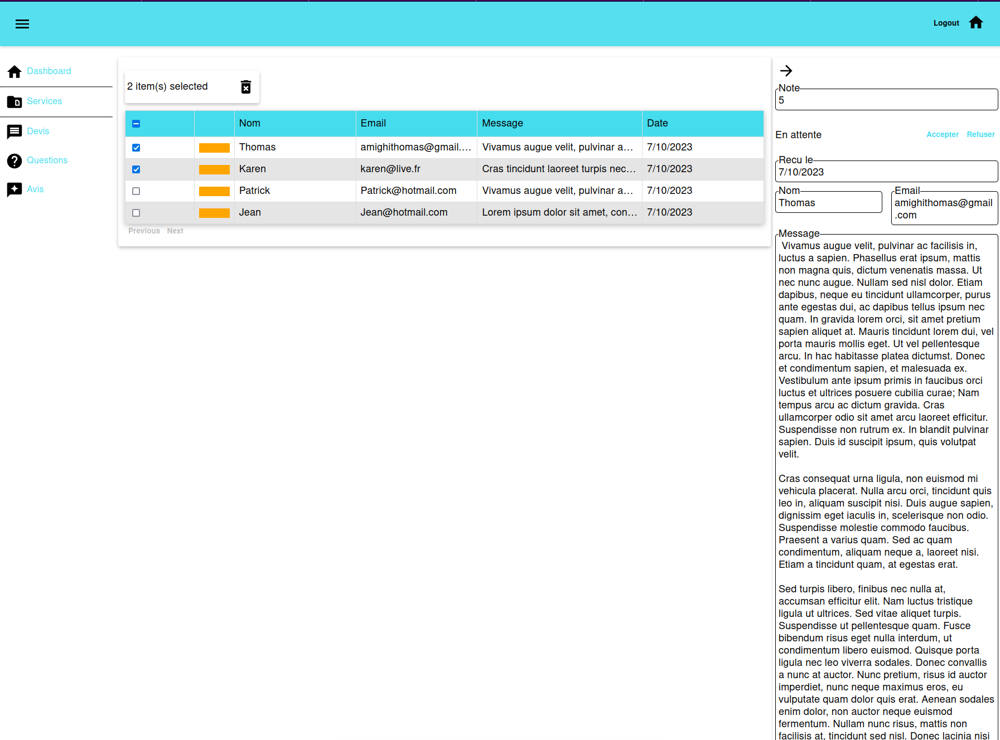

# correction-service-website

## Description

Full stack website with

- A react frontend (public and admin).
- A nestjs backend that serves a postgres database.
- A custom ui/utils library.
- An nginx configuration to serve static react bundles and redirect to backend.
- A docker containerization for development and production.

## Examples

### Frontend Homepage

</img>

### Frontend Goldenbook

</img>

### Admin

</img>

### Video


## How to run

Ensure first that docker is installed.

### Development (port 3000)

```sh
docker compose -f docker-compose.dev.yml up
```

### Production

```sh
mkdir ./deploy/ssl
openssl req -x509 -nodes -newkey rsa:2048 -keyout ./deploy/ssl/example.key -out ./deploy/ssl/example.crt -days 365
docker compose -f docker-compose.prod.yml up
```
